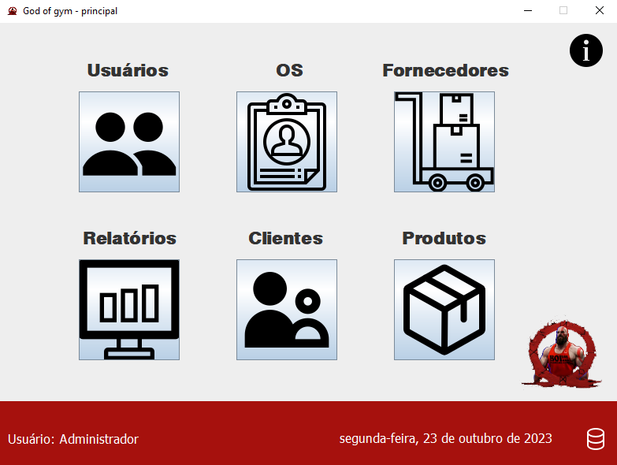

# God of Gym - Site
## Projeto integrador Senac, com participação do Iann, Felipe, Lucas e Jefferson.
 

## Descrição: 
 

<h3>O God of Gym é um abrangente sistema de ordem de serviço projetado para atender às necessidades específicas de academias, centros de treinamento e estúdios de fitness. Este sistema, composto por um site e um aplicativo móvel, oferece uma ampla gama de serviços e recursos para tornar a gestão das operações e a manutenção de equipamentos mais eficientes e eficazes.</h3>

 

## por trás do projeto
 

<H3> Inicialmente, foi necessário configurar uma máquina virtual para hospedar o site, sendo o Linux Server o sistema operacional escolhido para essa finalidade, ultilizamos o Wordpress em conjunto com o Elementor pro para fazer o site. </H3>
 

 

 

## Aplicativo
 
Confira também o nosso Sistema OS, é um sistema para gestão de ordem de serviços e estoque: 
https://github.com/felipea1/Academia-SistemaOS/blob/main/godofgym/README.md?plain=1
 

 

 

### Nossas redes sociais: 

 

<h1> Iann </h1>
 

 

<h1> Felipe </h1>
 

 

<h1> Lucas </h1>
 

 

<h1> Jefferson </h1>
 
